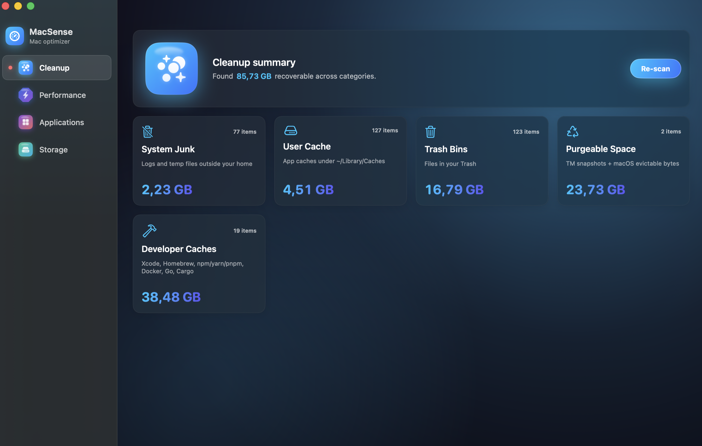
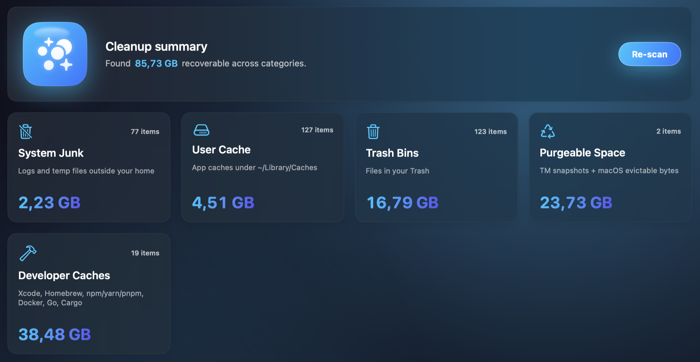
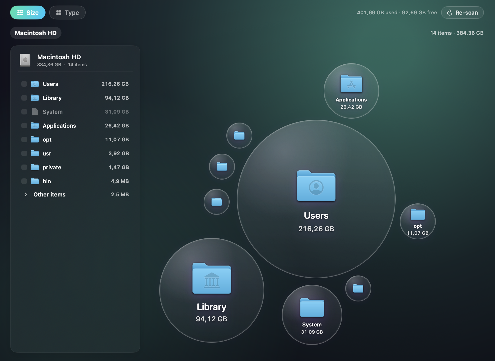
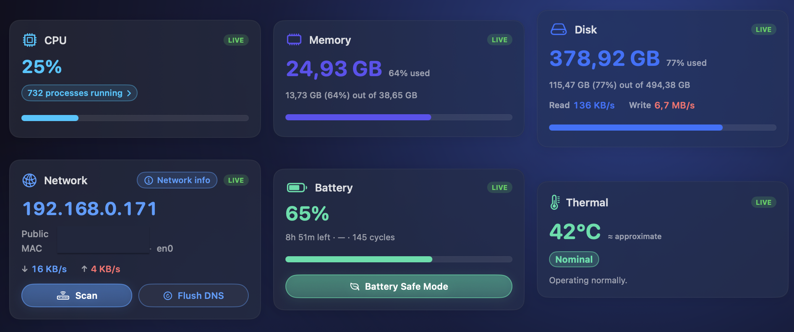
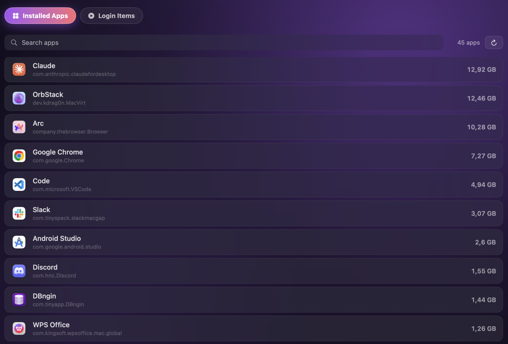
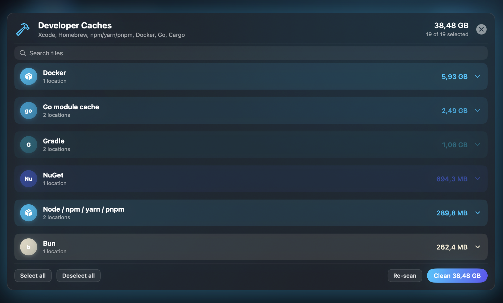
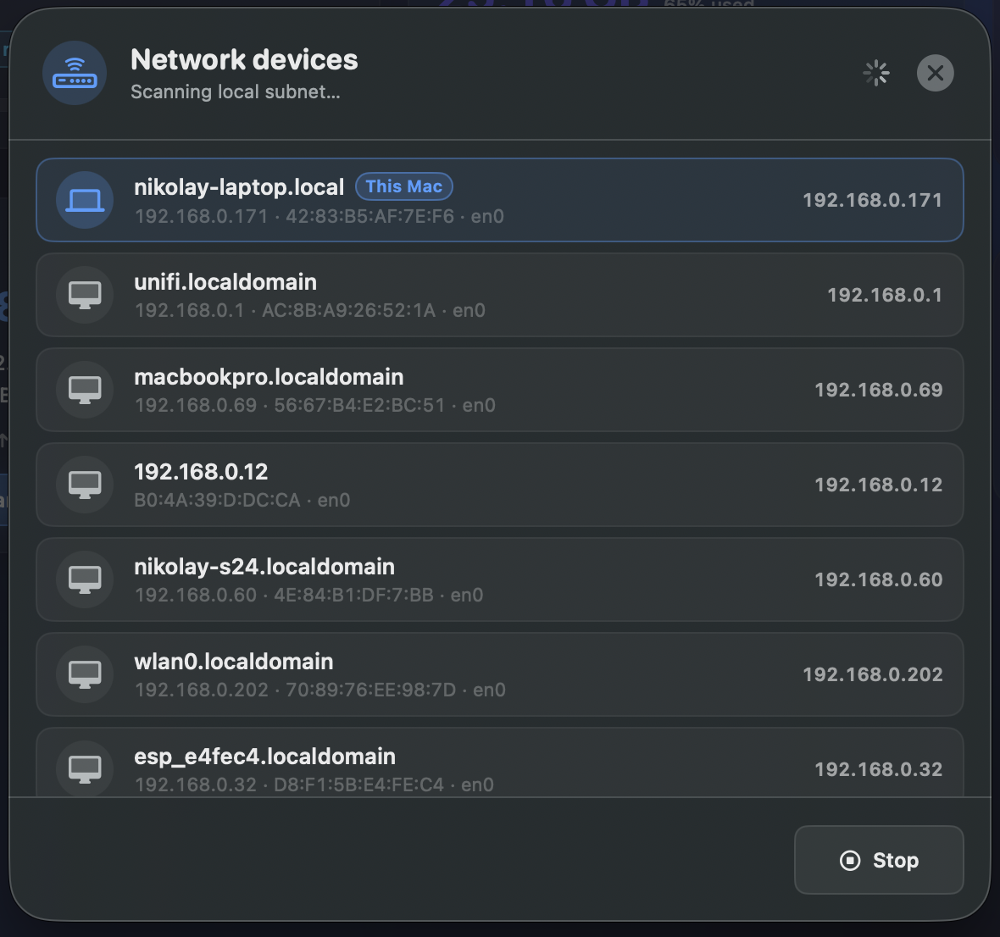

<div align="center">

# MacSense

**Free, native macOS optimizer that cleans junk, tames startup items, profiles performance, and visualizes disk usage — all in one glossy SwiftUI app.**



[Quickstart](#-quickstart) · [Features](#-features-at-a-glance) · [Screenshots](#-screenshots) · [Build from source](#-build-from-source) · [Roadmap](#-roadmap)

[](https://swift.org)
[](#)
[](LICENSE)
[](https://github.com/nikolayAsparuhov/MacSense/actions)

</div>

---

CleanMyMac and the like are subscription tools that mostly wrap commands you can run yourself. MacSense surfaces the same insights — system junk, dev caches, login items, large files, live performance, network details — without a paywall, telemetry, or background daemon. Open it when you need it, close it when you don't.

## ✨ Why MacSense

<table>
<tr>
<td width="50%">

### 🆓 Free + open source
<sub>MIT-licensed. No upsells, no analytics, no account.</sub>

</td>
<td width="50%">

### 🔒 Local only
<sub>Everything runs on your Mac. The only network call is one optional public-IP lookup.</sub>

</td>
</tr>
<tr>
<td>

### 🧹 Real cleanup
<sub>Dev caches for 30+ tools (npm, pip, Cargo, NuGet, Maven, Go, …), system junk, Docker, purgeable space, Time Machine snapshots.</sub>

</td>
<td>

### 📊 Honest visualizations
<sub>Bubble-map storage explorer, live CPU/memory/disk/network meters, top processes, login-item audit.</sub>

</td>
</tr>
<tr>
<td>

### 🛡️ Safe by default
<sub>Files go to the Trash, not deleted. Embedded login items can't be corrupted. Confirmation before every destructive action.</sub>

</td>
<td>

### ⚡️ Native SwiftUI
<sub>No Electron, no helper daemon. ~80 MB binary. Idle RAM bounded by aggressive cleanup on tab switch.</sub>

</td>
</tr>
</table>

## 🚀 Quickstart

**Download** the latest `MacSense.dmg` from [Releases](https://github.com/nikolayAsparuhov/MacSense/releases), drag the app into `/Applications`, launch.

Or build it yourself:

```bash
git clone https://github.com/nikolayAsparuhov/MacSense.git
cd MacSense
brew install xcodegen           # one-time, only if regenerating the project
open MacSense.xcodeproj         # then ⌘R in Xcode
```

That's it. No services to install, no permissions to grant up front.

## 🎯 First Steps

When the app opens you land on **Cleanup**. From there:

1. Click **Smart Scan** to see what every category is holding.
2. Switch to **Storage** and run a scan to get the bubble map of your disk.
3. Open **Applications → Installed Apps** to find big or unused apps and uninstall them with all their leftover files.
4. Visit **Performance** for live system stats, then click "Scan" in the Network card to discover devices on your LAN.

Nothing scans automatically. You decide what to look at.

## 📸 Screenshots

<table>
<tr>
<td></td>
<td></td>
</tr>
<tr>
<td align="center"><sub><b>Cleanup</b> — categories with size + recoverable totals</sub></td>
<td align="center"><sub><b>Storage</b> — bubble explorer, click to drill into folders</sub></td>
</tr>
<tr>
<td></td>
<td></td>
</tr>
<tr>
<td align="center"><sub><b>Performance</b> — live CPU, memory, disk, network, battery, thermal</sub></td>
<td align="center"><sub><b>Applications</b> — installed apps + login items, one-click uninstall</sub></td>
</tr>
<tr>
<td></td>
<td></td>
</tr>
<tr>
<td align="center"><sub><b>Developer caches</b> — 30+ ecosystems, grouped by tool</sub></td>
<td align="center"><sub><b>Network scan</b> — discover every device on your LAN with IP, MAC, hostname</sub></td>
</tr>
</table>

## 🏠 Who is it for

<table>
<tr>
<td width="33%" align="center">

### 👨‍💻 Developers
<sub>Wipe gigabytes of npm/Cargo/Maven/NuGet/pip caches. See where Xcode DerivedData is hiding.</sub>

</td>
<td width="33%" align="center">

### 🎨 Creators
<sub>Find huge old video / Photoshop / Logic exports across all drives in seconds.</sub>

</td>
<td width="33%" align="center">

### 🖥 Power users
<sub>Audit login items the App Store hides. Kill runaway processes. Check Wi-Fi RSSI.</sub>

</td>
</tr>
</table>

## 📋 Features at a glance

### 🧹 Cleanup
System junk · User caches · Trash bins · Purgeable space · iCloud offloaded · Time Machine snapshots · Docker images · Xcode DerivedData/Archives/Simulators · 30+ dev tool caches (npm, Yarn, pnpm, Bun, pip, Poetry, Conda, Cargo, Go, NuGet, Maven, Gradle, Composer, SwiftPM, pub, Hex, Cabal, Coursier, ccache, Bazel, Vagrant, Terraform, Pulumi, AWS SAM, …)

### 📊 Storage
Bubble-map drill-down · Per-folder sizes · Large + old file finder · By-media-type breakdown · Multi-select delete

### 📱 Applications
Installed-app inventory with combined size (bundle + caches + prefs + containers) · One-click uninstall (Trash) · Login items audit (User + System) · Toggle / disable / delete launch agents

### ⚡ Performance
Live CPU / memory / disk / network / battery / thermal · Top processes table with kill action · Network device scan · Wi-Fi + Ethernet diagnostics · Flush DNS

## 🛠 Build from source

Requirements:

- macOS 13 (Ventura) or newer
- Xcode 15 or newer
- (Optional) [`xcodegen`](https://github.com/yonaskolb/XcodeGen) — only needed if you edit `project.yml`

```bash
git clone https://github.com/nikolayAsparuhov/MacSense.git
cd MacSense
open MacSense.xcodeproj
# ⌘R in Xcode
```

Or from the command line:

```bash
xcodebuild -project MacSense.xcodeproj -scheme MacSense \
           -configuration Debug -destination 'platform=macOS' build
open build/Build/Products/Debug/MacSense.app
```

### Building a signed DMG

See [`scripts/build-dmg.sh`](scripts/build-dmg.sh). Requires a Developer ID Application certificate; falls back to ad-hoc signed for local testing.

```bash
./scripts/build-dmg.sh
```

## 🗺 Roadmap

- [x] Scheduled cleanup with notifications
- [x] Uninstall unused apps last 90 days
- [ ] Inline help + glossary
- [ ] Localization (currently English-only)

Have an idea? [Open an issue](https://github.com/nikolayAsparuhov/MacSense/issues/new) or send a PR.

## 🔒 Privacy + safety

MacSense never uploads your files, scan results, app inventory, or system metrics. The single network call the app makes is an opt-in public-IP lookup against `api.ipify.org` (with `ifconfig.me`, `icanhazip.com`, `ipv4.icanhazip.com` as fallbacks). Disable your network and the rest of the app still works fully offline.

Destructive actions:
- Files always move to Trash, never delete-in-place
- Login items registered via SMAppService cannot be modified by third-party apps (macOS restriction); MacSense surfaces this and links to System Settings → Login Items
- Confirmation dialog before every multi-file delete

See [SECURITY.md](SECURITY.md) for the responsible-disclosure policy.

## 🤝 Contributing

PRs welcome. Read [CONTRIBUTING.md](CONTRIBUTING.md) before submitting.

Quick rules:

- Build must be warning-free (`xcodebuild ... | grep -E "warning:|error:"` returns nothing)
- New features need at least one screenshot in the PR
- Stick to the existing `GlossyCard` / `Theme.Palette` design system

## 📄 License

[MIT](LICENSE) — do whatever you want, just don't blame us if it eats your homework.

## 💬 Support

- [Open an issue](https://github.com/nikolayAsparuhov/MacSense/issues) for bugs and feature requests
- [Discussions](https://github.com/nikolayAsparuhov/MacSense/discussions) for questions and ideas
- Star the repo if MacSense saved you some disk ⭐
